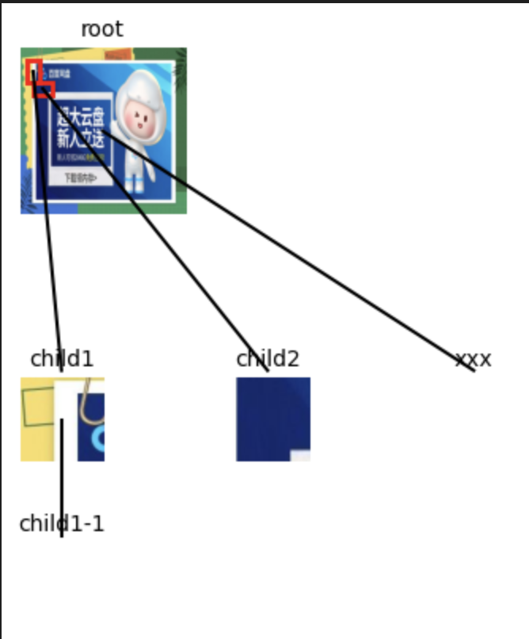

# d3_jupyter

A easy using lib for visulization data like tree, graph and so on in jupyter with d3.js and matplotlib

------

The project provides a easy way to visulize tree/graph data in jupyter.

You can use F12 to debug d3 code just like a html and javascript developer.

dir | note
---|---
d3_jupyter | the core lib code base on d3
plt_jupyter | the core lib code base matplotlib
demo | demo showing how to use d3_jupyter
scrath | demo showing how to do same thing without d3_jupyter (much more code)


# How to use

## 1. Tree
```sh
cd demo
```

```py
import sys
sys.path.insert(0, '../')  # insert path of where the project located.
import plt_jupyter


tree_data = {
        "text": "root",
        "image": "../test_data/tree/img1.jpg",
        "scale": 2.0,
        "text_sep": 0.1,
        "children": [
            {
                "text": "child1",
                "image": "../test_data/tree/img1.jpg",
                "bbox_of_parent": [50, 50, 150, 150],  # 从根节点图片中裁剪区域
                "need_crop": True,
                "children": [
                    {
                        "text": "child1-1",
                    }
                ]
            },
            {
                "text": "child2",
                "image": "../test_data/tree/img1.jpg",
                "bbox_of_parent": [100, 150, 250, 200]  # 从根节点图片中裁剪区域
            },
            {
                "text": "xxx",
            }
        ]
    }

fig, ax = plt_jupyter.plot_tree_data(tree_data)
ax.set_axis_off()
```

